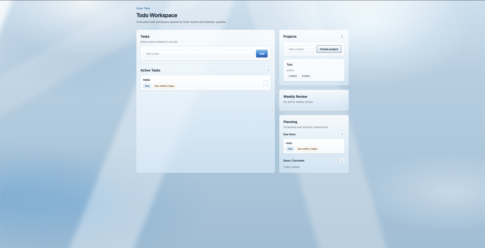

# grain-todo-list

A teaching project for learning how to build with Grain through a small todo
workspace.

This repository accompanies **Grain Sessions**, a video series about how to use Grain:

- Episode 1: https://youtu.be/tO--joFrYUE
- Episode 2: https://youtu.be/plMAG4FASdk
- Episode 3: https://youtu.be/weAsNioiEnI
- Episode 4: https://youtu.be/XRo49q6yCeo



## What This Demonstrates

The app is intentionally small, but it exercises the main parts of a Grain
application:

- Capturing, renaming, reordering, completing, canceling, archiving, and
  reactivating tasks.
- Grouping work into projects and tracking project task counts.
- Marking tasks as due within a number of days.
- Reviewing active tasks and projects through a weekly review workflow.
- Building server-rendered UI from Grain query results with the Grain Datastar
  checked UI DSL and Hiccup.
- Organizing command handlers, event schemas, read models, query handlers,
  processors, periodic tasks, and UI in a compact Clojure app.

## How It Works

The app uses:

- **Grain** for commands, queries, events, read models, request handlers,
  processors, and periodic tasks.
- **Datastar** for server-rendered reactive pages.
- **Integrant** for application composition and lifecycle.
- **Tailwind CSS** and **DaisyUI** for styling.
- An in-memory event store and temporary LMDB cache for local development.

The code is laid out as a small Clojure project rather than a Polylith system.
The todo domain lives under `src/cjbarre/grain_todo_list/todo_list_service/`,
with the root app namespace handling system startup and routes.

## Project Map

```text
.
├── src/cjbarre/grain_todo_list.clj               # Integrant system, routes, lifecycle
├── src/cjbarre/grain_todo_list/ui.clj            # App shell and page chrome
├── src/cjbarre/grain_todo_list/ui/components.clj # Reusable visual primitives
├── src/cjbarre/grain_todo_list/todo_list_service/
│   ├── schemas.clj                               # Command, event, query, read-model schemas
│   ├── read_models.clj                           # Reducers and projection helpers
│   ├── commands.clj                              # Command validation and event emission
│   ├── queries.clj                               # Query assembly and UI render boundary
│   ├── ui.clj                                    # Todo page composition
│   ├── ui/components.clj                         # Todo controls, cards, lists, gallery specimens
│   ├── todo_processors.clj                       # Todo processor lifecycle
│   └── periodic_tasks.clj                        # Periodic trigger lifecycle
├── css/main.css                                  # Tailwind/DaisyUI input CSS
├── resources/public/                             # Generated static assets
├── test/                                         # Clojure tests
└── doc/pattern-compendium.md                     # Detailed architecture reference
```

## Requirements

- Clojure CLI
- Node.js and npm

The app must be started with the `:dev` alias because LMDB needs Java module
opens.

## Install Frontend Dependencies

```sh
npm install
```

## Build CSS

One-shot build:

```sh
npm run css:build
```

Watch mode while developing UI:

```sh
npm run css:dev
```

The CSS build writes to `resources/public/css/main.css`.

## Run The App

Start an nREPL:

```sh
./scripts/nrepl.sh
```

Then evaluate:

```clojure
(require '[cjbarre.grain-todo-list :as app])
(def system (app/start))
```

Open:

```text
http://localhost:8080/
```

Stop the app:

```clojure
(app/stop system)
```

## Development Loop

Typical local loop:

```sh
npm run css:dev
```

In another terminal:

```sh
./scripts/nrepl.sh
```

Then work from the REPL. Reload namespaces after edits and restart the
Integrant system as needed

## Tests And Checks

Run tests:

```sh
clojure -T:build test
```

Run clj-kondo:

```sh
clj-kondo --lint src test
```

## Agent Instructions

Agent-facing implementation notes live in [AGENTS.md](AGENTS.md). The deeper
pattern reference is [doc/pattern-compendium.md](doc/pattern-compendium.md).
